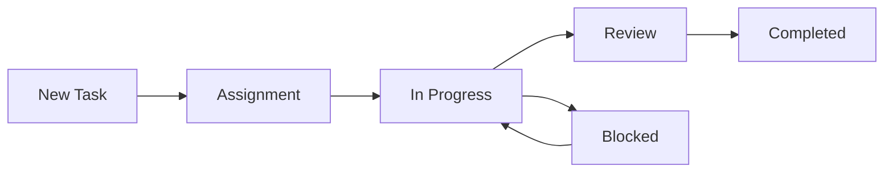

# Task Management Workflow

This document describes the standard workflow for managing tasks in the project.

## Task Lifecycle

1. **Task Creation**
   - Added to `DEVELOPMENT_STATUS.yaml`
   - Dependencies specified
   - Priority assigned
   - GitHub issue created

2. **Task Assignment**
   - AI/developer claims task
   - Status updated to "in_progress"
   - GitHub issue labeled
   - Project board updated

3. **Task Execution**
   - Work performed
   - Progress logged
   - Dependencies tracked

4. **Task Completion**
   - Status updated to "completed"
   - Dependent tasks unblocked
   - GitHub issue closed
   - Project board updated

## GitHub Integration

### Issues
- Each task has corresponding GitHub issue
- Issue numbers match task IDs
- Labels reflect current status
- Dependencies linked in issue body

### Project Board
- Columns match task statuses
- Automated moves via GitHub Actions
- Visual representation of workflow

## Status Updates

### When to Update
- Starting work on task
- Making significant progress
- Completing task
- Encountering blockers
- Resolving dependencies

### How to Update
1. Use provided scripts
2. Update YAML directly (if necessary)
3. Sync with GitHub
4. Log activity

## Example Workflow

## Best Practices

1. **Communication**
   - Log all significant actions
   - Keep GitHub issues updated
   - Document blockers immediately

2. **Dependency Management**
   - Check dependencies before starting
   - Update downstream tasks
   - Maintain graph accuracy

3. **Status Consistency**
   - Sync YAML with GitHub
   - Use provided scripts
   - Verify updates
